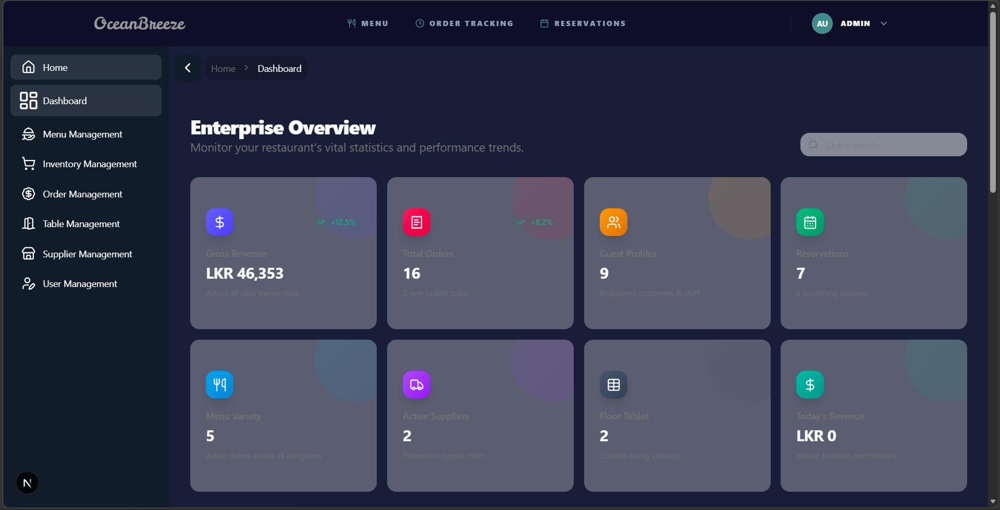

# 🍽️ OceanBreeze Restaurant Management System

A comprehensive full-stack web application for managing restaurant operations including menu management, orders, inventory, staff, and analytics.



## 📋 Features

- **Dashboard Analytics** - Real-time revenue tracking and KPI monitoring
- **Menu Management** - Add, edit, and manage menu items with categories
- **Order Management** - Process dine-in and takeaway orders
- **Inventory Tracking** - Monitor stock levels and movements
- **Supplier Management** - Manage supplier information and contracts
- **User Management** - Role-based access control (Admin, Chef, Waiter, Customer)
- **Table Management** - Manage dining tables and reservations

## 🛠️ Tech Stack

### Frontend
- Next.js 16 (React 19)
- Tailwind CSS
- Shadcn/UI Components
- Recharts for analytics

### Backend
- Node.js & Express.js
- MongoDB with Mongoose
- JWT Authentication
- bcryptjs for password hashing

## 📁 Project Structure

```
Restaurant_Management_122/
├── frontend/              # Next.js frontend application
│   ├── app/              # App router pages
│   ├── components/       # Reusable UI components
│   ├── lib/              # Services and utilities
│   └── public/           # Static assets
│
└── server/               # Express backend API
    ├── src/
    │   ├── controllers/  # Business logic
    │   ├── models/       # MongoDB schemas
    │   ├── routes/       # API endpoints
    │   └── middleware/   # Auth & error handling
    └── server.js         # Entry point
```

## 🚀 Getting Started

### Prerequisites
- Node.js (v18 or higher)
- MongoDB (local or Atlas)
- npm or yarn

### Installation

1. Clone the repository
```bash
git clone https://github.com/Umindu-Nimsara/Restaurant_Management_122.git
cd Restaurant_Management_122
```

2. Install frontend dependencies
```bash
cd frontend
npm install
```

3. Install backend dependencies
```bash
cd ../server
npm install
```

4. Configure environment variables

Frontend (.env.local):
```env
NEXT_PUBLIC_API_URL=http://localhost:5000/api
```

Backend (.env):
```env
MONGO_URI=your_mongodb_connection_string
JWT_SECRET=your_jwt_secret
PORT=5000
```

5. Start the development servers

Backend:
```bash
cd server
npm run dev
```

Frontend:
```bash
cd frontend
npm run dev
```

6. Open http://localhost:3000 in your browser

## 👥 User Roles

- **ADMIN** - Full system access
- **CHEF** - Order queue management
- **WAITER** - Order creation
- **CUSTOMER** - View menu and order history

## 🔐 Authentication

- Email/Password login
- PIN-based quick login for staff
- JWT token-based authentication
- Session timeout after 10 minutes of inactivity

## 📝 API Documentation

API documentation is available via Swagger UI at:
```
http://localhost:5000/api-docs
```

## 🤝 Contributing

This is a group project. Team members should:
1. Create a feature branch
2. Make changes
3. Submit a pull request
4. Wait for review before merging

## 📄 License

This project is for educational purposes.

## 👨‍💻 Developed By

Group 122 - Restaurant Management System Team
